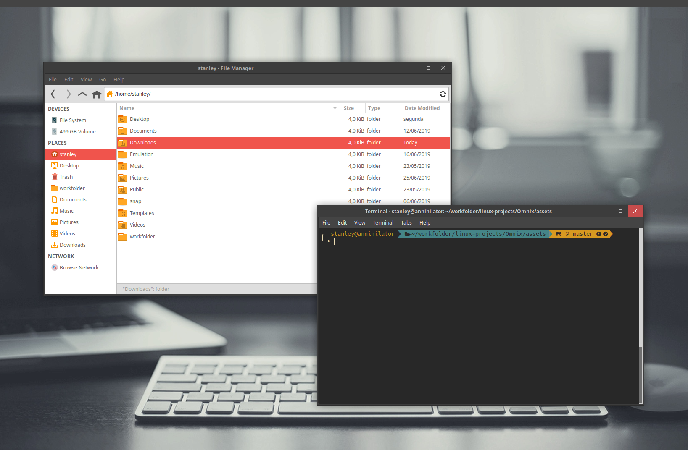

# Omnix theme

The **Omnix** theme is a theme built specially for Xfwm4 (XFCE Window Manager). Due that, it only decorates your windows' borders and titles.

A recommended GTK theme to be used along with Omnix is the [Numix](https://github.com/numixproject) one. If you are using Xubuntu, Numix already comes as a pre-installed theme.

  

