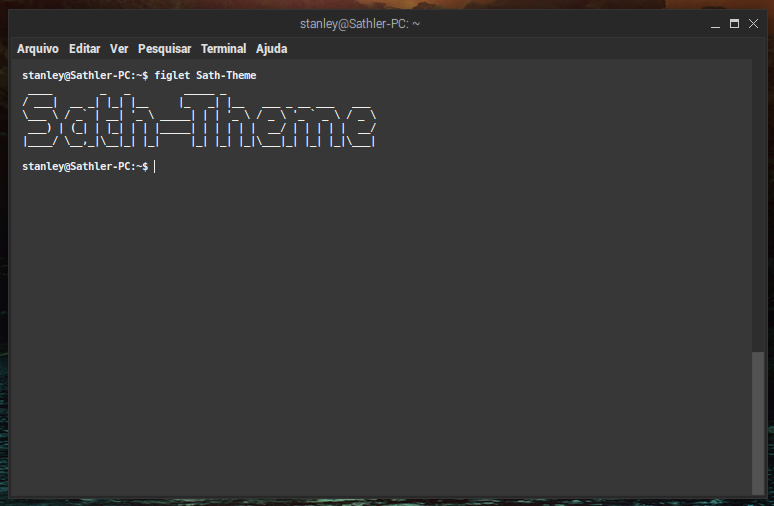

# Sath-Theme

## What is this?
Sath-Theme is a minimalist theme created for Xfwm4 (XFCE Window Manager). It is highly based on [Rele, created by p0ng](https://www.xfce-look.org/p/1016647/).

## Screenshot
**NOTE:** the theme is applied, for now, only to XFCE Window Manager. If you are new on Linux and don't know yet, themes for Window Manager is limited only to the windows' borders (including buttons, like close, maximize and hide). So, your buttons, checkboxes, text edits and other UI elements will not be affected by this theme.



## How can I install?
There are two different ways of install any theme on XFCE:

1. Install it on ```/usr/share/themes```
2. Install it on ```/home/your-username/.themes/```

Does not matter the folder you choose, everything you need to do is clone this repository inside of the chosen folder.
